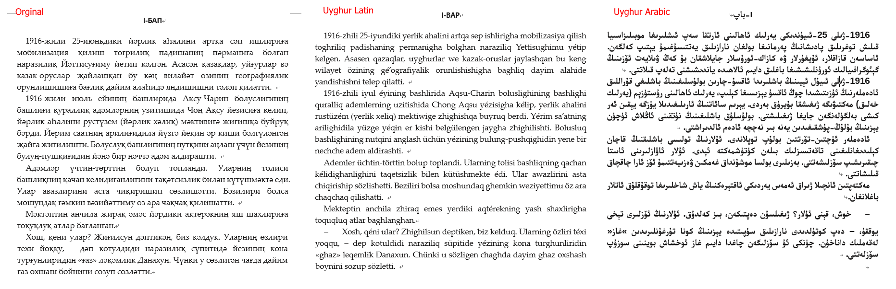

Bu Microsoft Wordning qisturmisi bolup, Uyghurche Word höjjitini biwasite aylanduridu. eslidiki höjjetning formatigha tesir yetmeydu.
UEY(Uyghur Ereb yéziqi), ULY(Uyghur Latin Yeiziqi), USY(Uyghur slawyan(kiril) yéziqi) arisida oz ara almashturush élip baralaydu.

Ornitish usuli:
1. uls.dotm, ulsdelete.bat, ulssetup.bat dégen uch höjjetni oxshash bir yerge köchürisiz.
2. Ijra boluwatqan barliq WORD ni axirlashturisiz.
3. ulssetup.bat ni qosh chékisiz(ijra qilisiz). tamam.
4. WORD ni ijra qilip, ADDIN dégen tizimlikke qaraysiz. Töwendikidek körünse normal ornitilghan bolidu.

  

Töwendikisi Eslidiki USY da yézilghan tékistni ULY we UEY gha aylandurghandiki körünüsh.(Eslidiki höjjet pichimi(formati) shu péti saqlinip qalidu).
Xemit Hemrayewning «Ghulja Yoli» namliq esiridin.

  

