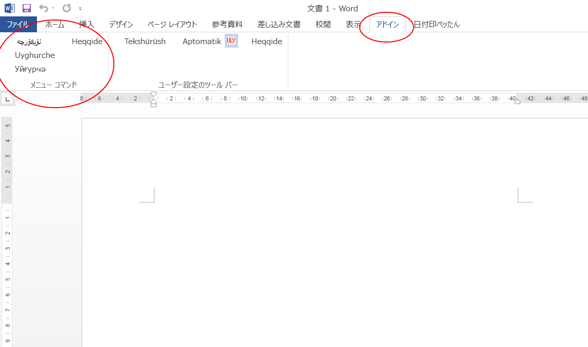

Bu Microsoft Wordning qisturmisi bolup, Uyghurche Word höjjitini biwasite aylanduridu. esliki höjjetning formatigha tesir yetmeydu.
UEY(Uyghur Ereb yéziqi), ULY(Uyghur Latin Yeiziqi), USY(Uyghur slawyan(kiril) yéziqi) arisida oz ara almashturush élip baralaydu.

Ornitish usuli:
1. uls.dotm, ulsdelete.bet, ulssetup.bet dégen uch höjjetni oxshash bir yerge köchürisiz.
2. Ijra boluwatqan barliq WORD ni axirlashturisiz.
3. ulssetup.bet ni qosh chékisiz(ijra qilisiz). tamam.
4. WORD ni ijra qilip, ADDIN dégen tizimlikke qaraysiz. Töwendikidek körünse normal ornitilghan bolidu.

  

